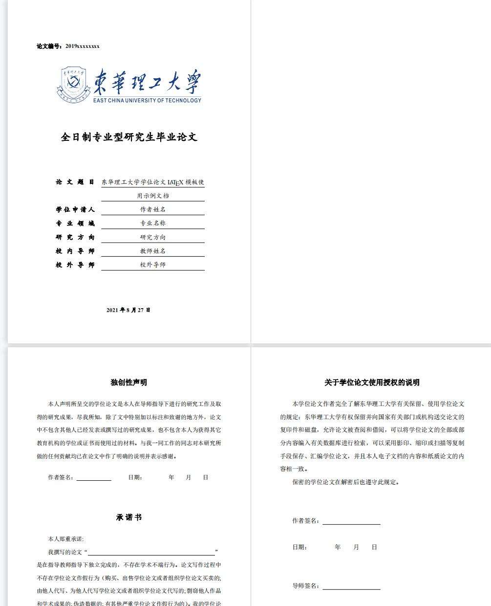

# 东华理工大学毕业论文 LaTeX 模板

本项目为东华理工大学毕业论文 LaTeX 模板，该模板是在[武汉大学毕业论文 LaTeX 模板](https://github.com/whutug/whu-thesis)的基础上修改而来的。目前仅支持全日制学硕/专硕硕士论文模板。

根据[《东华理工大学研究生学位论文格式规范标准》](https://yjsy.ecut.edu.cn/e4/06/c458a58374/page.htm) 编写，力求合规，简洁，易于实现，用户友好。

## 样例展示

  

正文样例可以参照 [ecut-thesis-demo](ecut-thesis-demo.pdf)

## 如何使用

使用前请阅读[使用文档](ecut-thesis-doc.pdf)

推荐两种方式进行编辑和编译：

* [本地编译](#本地编译)
* [Overleaf 在线编译](#overleaf-在线编译)

### 本地编译

本地编译需要安装 TeX 发行版软件, 具体可参见 [本地安装使用指南](https://github.com/mtobeiyf/whu-thesis/wiki/%E6%9C%AC%E5%9C%B0%E5%AE%89%E8%A3%85%E4%B8%8E%E7%BC%96%E8%AF%91)

### Overleaf 在线编译

[Overleaf](https://www.overleaf.com/) 是一个简洁的在线 LaTeX 编辑器。无需安装，实时共享，版本控制。该模板支持了 Overleaf 的在线编辑，可以从上面的模板链接直接创建自己的项目。

使用该模板时，需要设置 `XeLaTeX` 或 `LuaLaTeX` 为编译器，具体步骤请查看 [Overleaf 在线编辑](https://github.com/mtobeiyf/whu-thesis/wiki/Overleaf-%E5%9C%A8%E7%BA%BF%E7%BC%96%E8%BE%91)

## 后续计划

* 支持学硕学位论文模板

## 致谢

其它高校的相关开源项目

* [whu-thesis](https://github.com/whutug/whu-thesis)
* [bsThesisWHU](https://github.com/csarron/bsThesisWHU)
* [HUSTPaperTemp](https://github.com/skinaze/HUSTPaperTemp)
* [SJTUThesis](https://github.com/sjtug/SJTUThesis)
* [ustcthesis](https://github.com/ustctug/ustcthesis)
* [TJU-thesis-template](https://github.com/liangzhenduo0608/TJU-thesis-template)
* [xdba-thesis](https://github.com/xdlinux/xdba-thesis)
* [NEUBachelorThesis](https://github.com/tzaiyang/NEUBachelorThesis)
* [ThuThesis](https://github.com/tuna/thuthesis)
* [fduthesis](https://github.com/stone-zeng/fduthesis)

